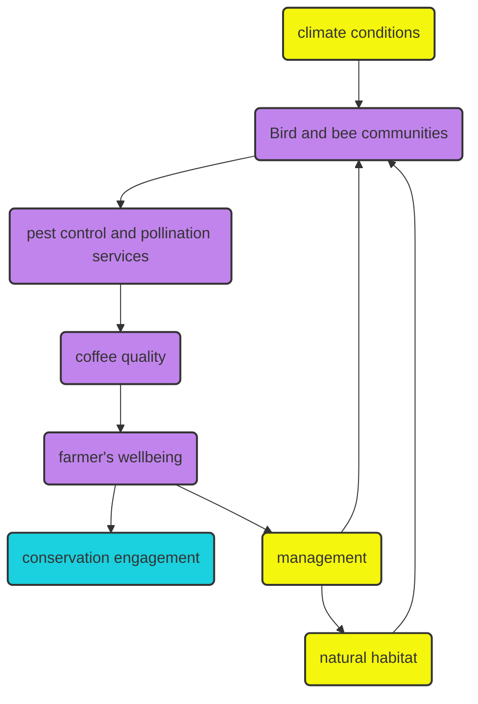

My main question is: How will climate change and forest loss affect the ecological processes that benefit coffee production? The flowchart above shows the variables I am interested in measuring and how they influence each other. In other words, the flowcharts show the hypotheses I am starting to come up with. 

In yellow, my independent variables, in purple, my dependent variables and in blue the hopeful outcome of my research program. 

Below are some pre-graphs to show how variables relate to one another, or my predictions.

